# T3A2 Part B Server

## Auth Controller

This code is part of the user sign up process in the Node.js backend. It is designed to handle the logic of signing up a user by creating a new user entry in the database.

### Importing dependencies
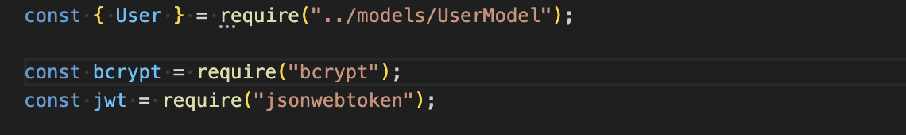

- <b>User</b> is imported from a file named UserModel, which contains the schema for the user model which allows it to interact with the database.
- <b>bycrypt</b> is a library that is used to salt and hash passwords to ensure secure storage of user passwords.
- <b>jsonwebtoken</b> is used to create and verify JWT web tokens, and is generally used for authentication, after the user has successfully registered.

### Defining signupUser function

This function is asynchronous and is designed to handle the signup process with the user submits their details via the frontend form.

### Data Extracting from request body
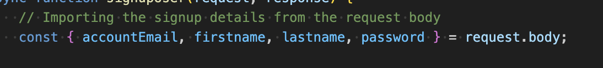

This sends the user data from the signup form to request.body. Here we extract the user information accountEmail, firstname, lastname, and password from the request body.

### Checking if email exists in the database
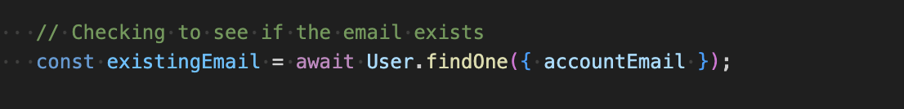

The <b>User.findOne()</b> code will check if there is an existing user in the database with the supplied accountEmail. This will query the database and will return null if no user present with a matching email address or will return the user object if it does exist.

This code has checked if the email is already in use
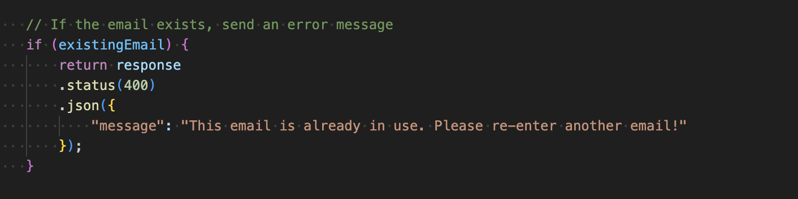

If the email already exists, the server responds with a <b>400</b> HTTP status telling the user to use another email address.

### Hashing passwords
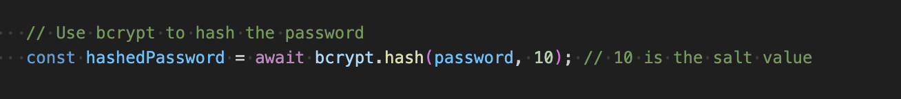
)
This line of code is used to "hash" the user's password before storing it into the database. <b>bcrypt.hash()</b> function provides the bcrypt library that will take two arguments, the plain text password supplied by the user, and the salt rounds or cost factor used to generate the hash. The salt is a random value added to the password before hashign to make sure that even if two users have the same password the has values are different.

### UserModel
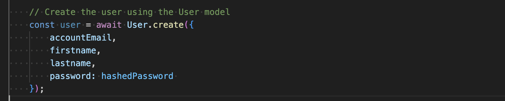

This code is used to create.save a new user using the database User model.
- <b>User.create()</b> is part of the ORM (Object Relational Mapping) framework, like Mongoose if you're using MongoDB. It is used to create a new instance of the User model and save it directly to the database in one step.

- The <b>await</b> keyword ensures the code waits until the user has been successfully crated and saved to the database before moving on to the next line of code. It allows the function to work asynchronously but in a way that looks and acts like synchronous code.
- The object that is passed to <b>create()</b> contains the fields that the Usermodel expects to save. In this instance these fields are;
        accountEmail
        firstname
        lastname
        password (this will be hashed with bcypt)

The <b>User.create()</b> method will take this object, map the data to the corresponding fields in the database and insert the data into the appropriate collection (aka users collection in this instance). Once this is successfully executed, it will return the newly created user object which now contains all the properties just saved into the database, this will also have a database generated field such as ID and/or timestamp.

The <b>await User.create()</b> is stored inside the user variable. This now holds the newly created complete user object that has just been saved to the database. You can now use it for further processing or send it back to the client in response.

### Response Status
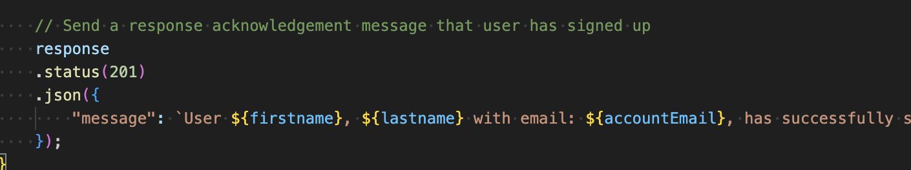

This part of the code is responsible for sending a response back to the client at the front end to whoever many the request, after the user has been signed up successfully.

The <b>response.status()</b> method is used to set the HTTP status code for the response, the status code 201 is created which indicates that the request has been fullfilled. This means the users signup request was successful and the new entry has been created in the database.

The <b>.json({...})</b> method is used to send a JSON response back to the client, the object passed into <b>.json()</b> will be converted to a JSON format and sent back as the response body. The dynamic string using the template literals constructs a message which confirms the successful signup of the user. The placeholders ${firstname}, ${lastname}, ${accountEmail}, will be replaced with the actual values received from the user from the request body.

The client sends a <b>POST</b> request to the server with the users signup details (eg name, email, password),the server then processes the request, it will check if the email is unique, hash the password, then creates the user in the database and returns a response. The message in the response body confims the user has been successfully signed up.

### Login User Function

This is the login user function, it is typically part of the authentication flow. The code starts by extracting the email and password from the request body. The <b>request.body</b> contains the data that the client sends when they attempt to log in. It is expected to be an object with the variables of accountEmail and password.

The <b>const user = await User.findOne()</b> code is searching for a user with the supplied accountEmail. User is the model representing the users in the database, the query will return the user object if a matching user is found in the database or null if no user is found to match the supplied email. If no user is found the function will then send an error response HTTP Status 400. This is a "bad request" status code which indicates that the request made by the client is invalid. It is invalid because the email has not been found in the database. the <b>response.json()</b> method sends a JSON object with a message informing the client that the email does not exist and directs them to the signup page.

The pupose of this code is to authenticate the user, the first part of the code ensures the user who is attempting to log in has an account, it checks this by searching the database for the given accountEmail. It will then check if the given password matches the hashed password stored in the database. If the email exists and the password is correct, then the server will generate a JWT token that they client can use to authenticate furture requests. If the login is successful, the success response and JWT will be sent back to the client.

The complete flow;
    1. user enters email and password
    2. server checks if email is in database
    3. if email does not exist, error message is sent
    4. if email exists, server checks if supplied password matches hashed password stored in database
    5. if password is correct, server generates JWT token for authentication
    6. server sends acknowledgement message and generated token back to client.

This secure login system is a common approach, so passwords are never stored in plain text and tokens are used for stateless authentication.

### Is Password Valid
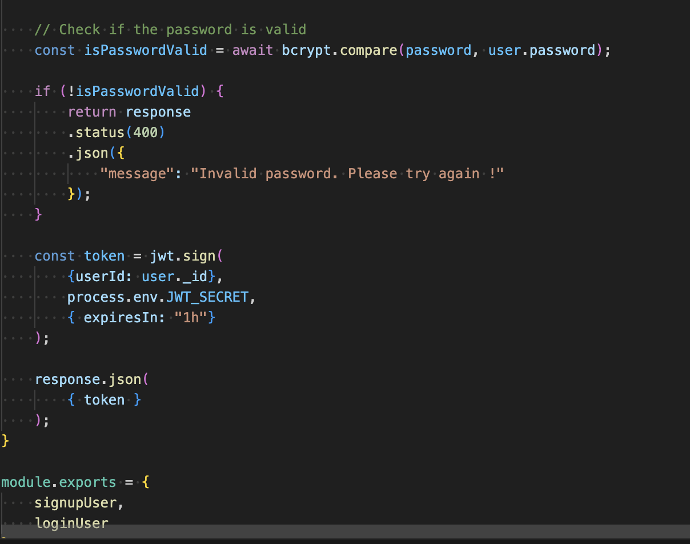

This code is part of the authentication process for user login, specifically in backend application of Node.js. It uses bcrypt for password hashing and JWT token creation after successful authentication.

<b>bcrypt.compare()</b> is an asynchronous function that compares a plain text password with the hashed password stored in the database. bcrypt is a popular library for hashing and comparing passwords securely. The function takes two arguments the first is the plain text password the second is the hashed password stored in the database that gets retrieved as the <b>user.password</b>. If the passwords match, <b>isPasswordValid</b> will be true, otherwise it is false. 

<b>await</b> is used because <b>bcrypt.compare()</b> returns a promise, so the function waits for the promise to be resolved before continuing.

if <b>!isPasswordValid</b> is invalid, then it is false, and returns a HTTP response indiciating the error <b>response.status(400).json({...}).</b> This sets the HTTP code status to 400 (bad request), which indicates that there is something wrong with the request, in this case password is incorrect. The <b>json({...})</b> sends a JSON response back to the client telling the client that the password is invalid, and to please try again. This informs the client that the log in attempt has failed due to incorrect password given.

<b>jwt.sign()</b> creates a JSON Web Token (JWT). The token is used for authenticating other requests from the client, so they don't have to log in again each request. 

<b>{ userID: user._id }</b> is the data that has been stored in the token, in this instance, its the user ID (user._id) which can later be used to identify the user when decoding the token.

<b>process.env.JWT_SECRET</b> is the secret key used to sign the token, it should be stored securely in your environment variable (.evn file) to prevent it from being exposed inside the code.
<b>{ expiresIn: "1h" }</b> this code sets the token exiry time for 1 hour after creation, so the client would need to log in again once the hour has passed to refresh the token.

<b>response.json({token})</b> this code sends the JSON response back to the client with the generated JWT token. The token is attached in the respose body as {token: 'your_generated_token}. The client can then store this token in their local storage or cookies and include it in the authorisation head of future requests to authenticate.

<b>module.exports = {signupUser, loginUser}</b> this line of code exports the two functions so they can be used in other parts of the application such as route handlers for both signup and login features.

## GiftList Controller

This code is used to import the GiftList model from a file called <b>GiftListModel.js</b> and is typically used to interact with the GiftList data in the database.

<b>require()</b> function is Node.js is used to import the modules, files or libraries.
<b>"../models/GiftListModel"</b> is the relative path to retrieve the model file located in the models folder.

The GiftList model is built using Mongoose, a popular MongoDB library and it is defined using a schema like giftListSchema. Mongoose is a wrapper for the schema that allows us to interact with the MongoDB database. It provides methods for performing database operations like querying data, saving, and updating records.

### Create GiftList
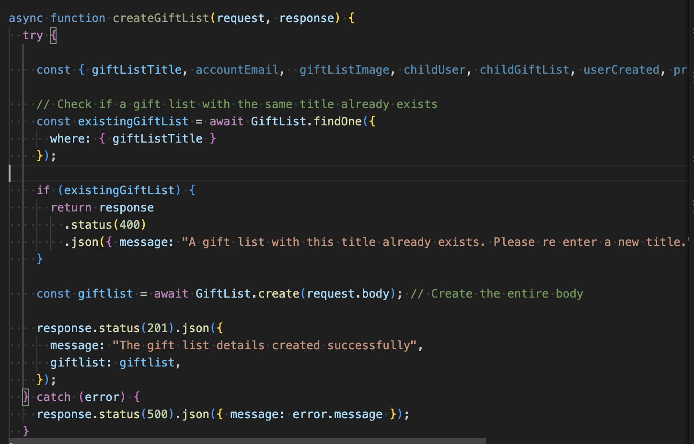

This function <b>createGiftList</b> is used to create the new gift list in the database, it processes the incoming request and performs several actions like checking for duplicate titles, creates new gift lists and handling errors.

The <b>async</b> function allows asynchronous operations such as database queries, which return promises that need to be awaited.
The <b>request</b> represents the HTTP request object, which contains the data sent by the client.
The <b>response</b> represents the HTTP response object which lets you send a response back to the client.

### Extracting Data from the Request Body
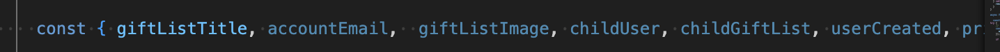

The <B>request.body</b> contains the data sent by the client, this code uses destructuring to extract the specific fields like GiftListTitle and accountEmail from the request body so they can be used individually in the function.

### Checking for an Existing Gift List
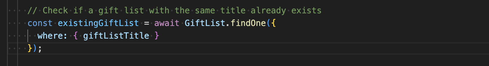

The code above searches the database to see if there is an existing giftList created. <b>GiftList.findOne()</b> method will search the database for a list that matches the given title <b>giftListTitle</b>. The <b>findOne()</b> method is a query function that returns a single document from the database that matches the condition.

The <b>await</b> keyword is an asynchronous operation and waits for the result of the operation before continuing the execution.

### Handling Duplicate Gift Lists
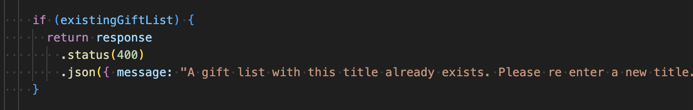

If a gift list with the same title alread exists in the database it will return a 400 Bad Request HTTP status code, indicating that the user request is not valid. It will send a JSON response with the message "A gift list with this title already exists. Please re enter a new title."

### Success Response - Gift List
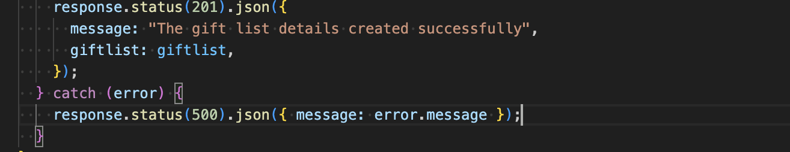
The <b>response.status(201)</b> sets the HTTP status code to 201(Created) this indicates that the user request was successful and the new gift list was created in the database.

### Handling Errors
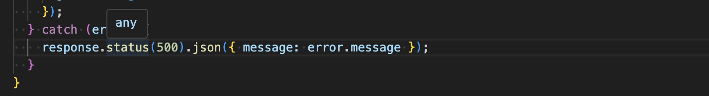

This code <b>try...catch</b> block is used to handle errors that may occur during execution of the function. If any errors occur ie invalid input or database error, the function sends a 500 Internal Server Error HTTP status code, indicating that something happened with the server.

### FindOne() Gift List
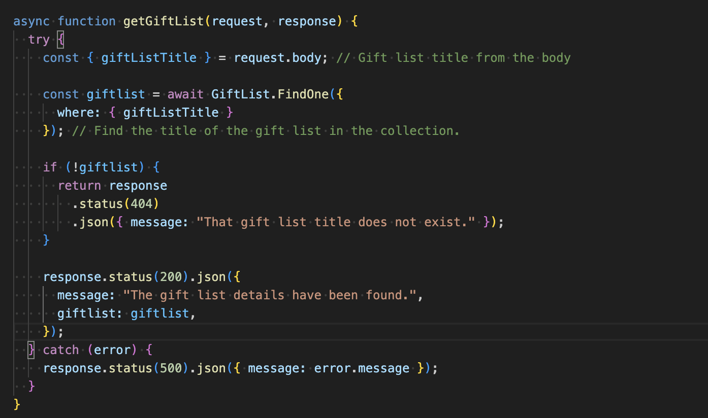

This section of code is designed to retrieve a gift list from the database based on the supplied gift list title the user inputs in the request body. It will perform error handling and return the relevant response to the client. 

The <b>async</b> function will perform asynchronous operations using await. While the <b>request</b> contains the data sent by the client in the way of query, parameters, body or headers. The <b>response</b> object is used to send the response back to the client.

The <b>request.body</b> code extracts the gift list title from the body of the request and pulls it out to use for the query. It will only find the gift list with the matching giftListTitle name. The <b>where</b> clause is used to match the document in the database with the giftListTitle provided in the request body, the function will look for a gift list with the matching title.

### Handling the Request when Gift List Not Found
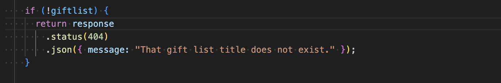

In the case where a gift list is not found with the supplied gift list title or is null, the block of code is executed. The <b>response.status(404)</b> sets the HTTP response status code to 404 not found, which indicates the rescource gift list could not be found. JSON then returns the message "That gift list title does not exist." This message is sent back to client to inform that the gift list was not found.

Inf the case where the gift list is found this sets the HTTP response status code to 200 OK indicating a successful request with the message "The gift list details have been found." The actual gift list data is returned to the client.

The try...catch block is used again to handle any errors that may occur during execution. If an error is thrown, the try block will handle it. This sets the HTTP response status to 500 Internal Server Error indicating something went wrong on the server. This will then send the JSON message back to the client what went wrong.

### Update Gift List Function
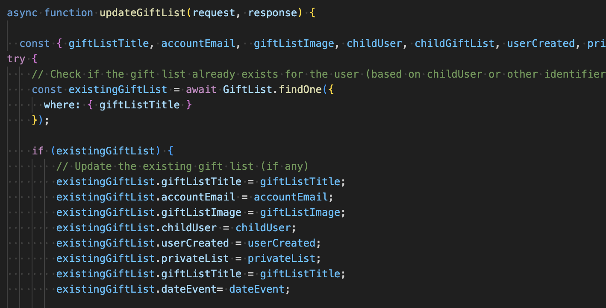

The update GiftList function is designed to update an existing gift list aleady created in the database. It will first check if the gift list with the user specific title already exists and then it will update the properties of the gift list according to the changes made.  It has an asynchronous function because it interacts with teh database, which is an I/O operation that returns a promise, the HTTP request object contains the incoming data and the HTTP response object will be used to send back the response to the client.  When extracting the data from the <b>request.body</b> the code will extract several properties, the giftList title, accountEmail, giftListImage, childUser, childGiftList, userCreated, privateList, dateEvent.

After the update <b>response.status(200).json</b> will send a success response back to the client with the message "Gift list updated successfully".

Error handling has also been addressed with a try... catch block to handle any errors that may occur during the execution of the function, <b>response.status(500)</b> will set the HTTP status to 500 Internal Server Error to indicate something went wrong witht the server, and a JSON error message which will be helpful with debugging.

### Delete Gift List
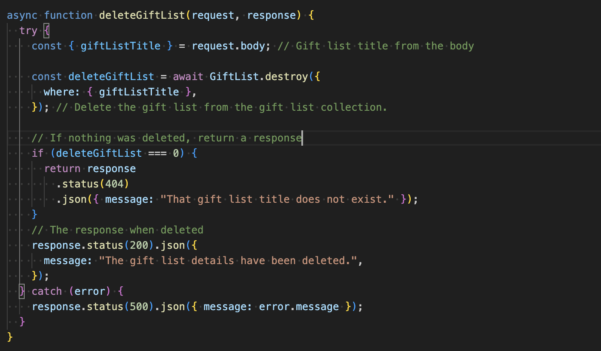

This code is designed to delete a gift list from the database based on the provided gift list title. First with <b>const {giftListTitle} = request.body;</b> the gift list title is extracted from the request.body the client is expected to send the gift list title in the request body which will be used to identify which gift list needs to be deleted. 

The code <b>GiftList.destroy()</b> method is used to delete records from the database that match the user gift list title that matches the giftListTitle. <b>where: {giftListTitle}</b> the where condition ensures that only the gift list that matches the condition is true will be deleted. The <b>await</b> ensures the function waits for the deletion operation to complete before proceeding. 

Checking if the deletion was successful with <b>return response .status(404) and puts the JSON message "That gift list title does not exist." confirms the gift list title has been deleted, as it no longer appears in the database when searched.

<b>deleteGiftList === 0 </b> The destroy() method returns the number of rows deleted. If no rows were deleted for example if no gift list with the specified title was found it will return 0. If no rows were deleted the function sends a 404 Not Found response with the message "That gift list title does not exist." This informs the client that no matching gift list was found in the database.

When sending a successful deletion response <b>response.status(200)</b> if the deletion is successful the function will send a 200 Ok status code indicating that the request was successful. The function returns a JSON response with a success message "The gift list details have been deleted."

Error Handling with try... catch block is used to handle any errors that mich occur during the execution of the function database errors or unexpected issues. If an error occurs in the try block, it is caught by the catch block and the function sends a 500 Internal Server Error response with the error message, helping to inform the client of the issue.

### Exporting the modules

        module.exports = {
            getGiftList,
            updateGiftList,
            deleteGiftList
        };
This code is exporting the three functions from a module so that they can be imported and used in other parts of the application. By exporting them this way other files can access and use these functions by requiring this file. Other files can then import and use these functions for their respective routes of business logic.
