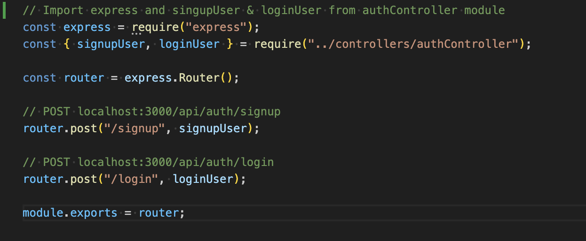
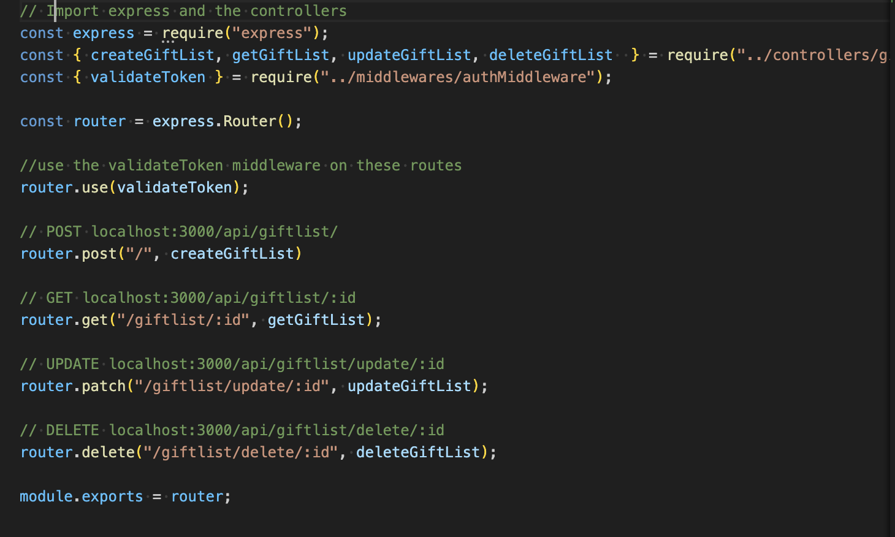

# T3A2 Part B Server

## Routes Importing

### authRoutes

This code snippet is importing <b>express, signupUser and loginUser </b> functions from the <b>authController</b> module.

    const express = require("express");
    const { signupUser, loginUser } = require("../controllers/authController");

    - express is a popular framwork for Node.js and it simplifies the process of handling the HTTP requests for routing, middleware and more. It is imported here to create an Express application to handle user requests like signing up and logging in.

    - when importing the two functions signupUser and loginUser from the authController module the functions are responsible for handling the sign up and login requests. The authController module contains the business logic related to authentication, signupUser handles the user registration while loginUser handles the verification to compare the password stores with the hashed stored password to confirm a match then return a JWT token to authenticate the user for future requests and access.

This code snippet is creating the Express Router instance for the express application, express.Router() is a feature that is provided by Express.js to modularise and organise the routes and define them for a specific set of URL's or paths.

    const router = express.Router();

The express.Routher() instance allows you to define the route handlers for HTTP methods like GET, POST, PUT, DELETE and associate them with their specifi URL patterns. Using a router helps keep your application modular by splitting the route logic into differenty modules and files, instead of one big file. You can use it to group related routes together or you can separate them within your application, keeping user-related routes in one file and authentication routes in another. 

This code snippet defines two POST routes for the user authentication, one is for the signup Route and one for the logi Route.

    // POST localhost:3000/api/auth/signup
    router.post("/signup", signupUser);

    // POST localhost:3000/api/auth/login
    router.post("/login", loginUser);

 
 When a POST request is made to the signupUser route the function is called. These functions take care of tasks like
    - validating data input
    - hashing the passwords for security
    - creating new users
    - respodning to client when new registration is successful

When a POST request is made to the loginUser route the function is called. These functions take care of the takes like
    - verifying the supplied login credentials ie username/email and password
    - compares the provided password with stored hashed password from the database
    - generates a JWT token if authentication is successful
    - returns a response back with the token (if correct) or an error message if invalid credentials are supplied.

This code snippet is the router object, which contains all the route definitions, it can be used in the main Express application and is mounted into the main app in app.js under a specified path like /api/auth.

    module.exports = router;

The <b>module.exports = router</b> is exported so it can be used by the main app. This structure keeps the authentication logic modular and allows for easy maintenance and scalability and maintains organisation.

## GiftList Routes

This code is setting up the routes in the express application to handle the Gift List related operations like CREATE, GET, UPDATE, and DELETE.

Firstly express is requred to create the express app and router.

    const express = require("express");
    const { createGiftList, getGiftList, updateGiftList, deleteGiftList  } = require("../controllers/giftListController");

Then the giftListController is where the logic for handling the gift lists is located. This file contains the actual implementation for creating, updating, fetching and deleting the gift lists.

    const { validateToken } = require("../middlewares/authMiddleware");

This validateToken middleware is used to check if the user is authenticated before being given access to any of the gift list routes.

    const router = express.Router();

This code creates the new router instance which will contain all the routes related to the Gift List. The validateToken middleware is applied toall routes in the router, this means for each request to any of these routes the miffleware will check if the user is authenticated and verify the JST token from the request headers. If the token is valid the request will continue, if the token is invalid or missing, it will return an error indicating authentiaction failure.

    // POST localhost:3000/api/giftlist/
    router.post("/", createGiftList)

This code defines the route when a POST request is sent to the giftlist and the createGiftList function is executed. It will validate the incoming data, create the new gift list in the database, then return a response to the client advising whether the gift list was successfully created of if there were any errors.

    // GET localhost:3000/api/giftlist/:id
    router.get("/giftlist/:id", getGiftList);

This code defines the route when a GET request for retrieving a gift list based on User ID. The route :ID in the URL is a route parameter, when a GET request is sent to the route it will retrieve the value of :id and use it to search the database for the corresponding gift list id. The getGiftList function will fetch the gift list from the database by the provided ID, then return the gift list data to the client. If gift list not found then it will return a 404 status error indicating that the list being search by id has not been found.

    // UPDATE localhost:3000/api/giftlist/update/:id
    router.patch("/giftlist/update/:id", updateGiftList);

This code defines a PATCH request route for updating an existing gift list based on its ID. The PATCH function will find the gift list by ID, then update the details with the supplied data in the request body, then return a respose to the client indicating whether the update was successful.

    / DELETE localhost:3000/api/giftlist/delete/:id
    router.delete("/giftlist/delete/:id", deleteGiftList);

This code defines a DELETE route to remove a gift list by its ID, the function will find and delte the fit list by provided ID, and return a response to the client to confirm the deletion. If not such gift list exists then it will return a 404 error Not Found.

    module.exports = router;

This code line exports the router instance so that it can be imported and used in the main app file or app.js