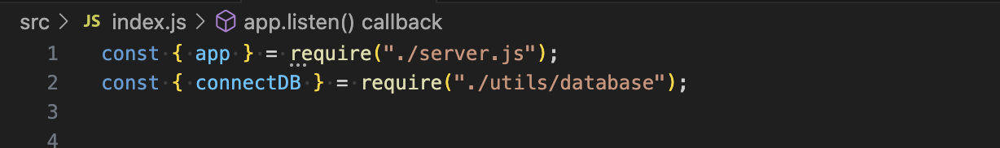
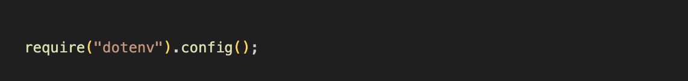
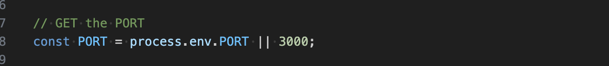
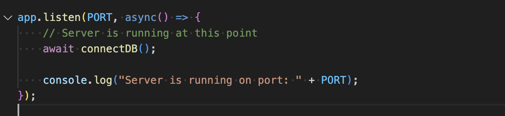
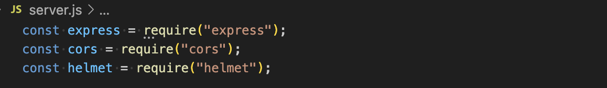
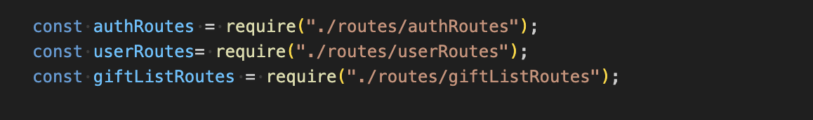
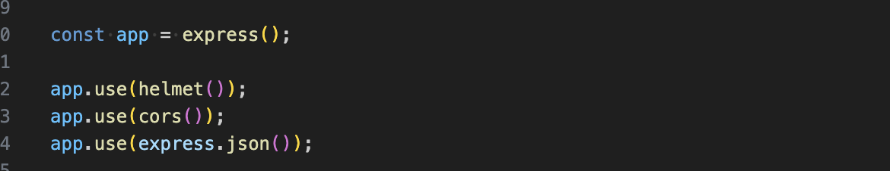
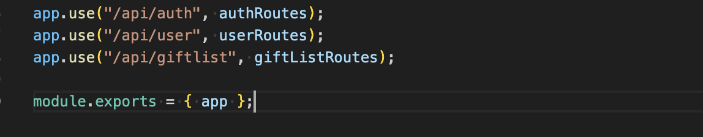

# T3A2 Part B Server

## Index
The index file is the entry point into a Node.js application and it sets up the server to listen to a specific port which will connec the database.

### Importing Modules

The require("./server.js") this line imports the app object normally an Express instance from a separate file named server.js. The app object is created using the Express framework, which is used to handle HTTP responses and requests.

The require('"/utils/database") imports the connectDB function from a file located inside the utils/database.js file, this connect DB function is responsible for connecting the applications database like MongoDB using appropriate credentials and authentication.

The require("dotenv").config() line loads the environment variables from a .env file into the process.env object. It is useful for storing the sensitive information in a secure manner for information such as API keys, port numbers and database credentials, instead of hardcoding them into the code itself.

### Getting the Port Number

This will check if the PORT environment variable is set, normally inside the .env file, however if not set the default port is 3000. The chosen port is assigned to the PORT constant which is used later to start the server.

The app.listed code line starts the server and makes it listen for incoming requests on the specific PORT. The async function inside the call back is executed once the server starts listening. The await connectDB() line calls the connect DB function to establish a connection to the database and await for a likely asynchronous function to return a promise, we need to ensure the database connect is established before we proceed. Once the server is running and the database is connected the line contacts the console to confirm the serve is running and listening on the specified port.

The above code snippets are responsible for starting the server and connecting the database. It loads all the variables from the dotenv and starts the server on the specified port (3000). The server will ensure that the database connection is established asynchronously before it logs a success message.  Once everything is set up the server will notify a message that it is running.

## Server
This is related to setting up an Express.js server with middleware and routing for handling the HTTP requests, it is broken down further for better understanding.

### Importing Dependencies

<b>express</b>
Express imports the framwork to simplify the HTTP handling process for processing requests, responses, middleware, and routing. Its the core of the web server.
<b>cors</b>
CORS stands for Cross Origin Resource Sharing which imports the middleware which allows or restricts resources from being requested from a different domain, it is useful in cases where you need to enable client side web apps hosted on different domains which interact with your server.
<b>helmet</b> is a security focused middleware which helps to secure the Express app by setting the HTTP headers to protect against certain web vulnerabilties for example clickjacking and more.

### Importing Routes

<b>authRoutes</b> handles authentication routes like registrations and logins.
<b>userRoutes</b> handles user related routes such as fetch, update etc.
<b>giftListRoutes</b> handles routes related to figt lists for creating, retrieving, updating and deleting gifts and gift lists.

### Express App Creation

<b> express</b>This small line of code const app - express() creates and Express application instance which is where the object is defined for middleware, routes and other configurations for the server.

<b>middleware - helmet</b> this code adds Helmet middleware to the app to help secure HTTP headers, it imporves security by mitigating attacks.

<b>middleware - cors</b> this middleware is useful in allowing cross-origin requests, so it allows the server to accept requests from different domains.

<b>middleware - express.json()</b> this middleware allows the server to parse incoming JSON requests and automaticallt converts incoming requests to a JSON object os it can be accessed easily by the route handlers.

### Setting up Routes

<b>api/auth</b> sets up a route to handle the requests that begin with /api/auth. All the routes defined in authRoutes will now be accessible under the URL path.
<b>api/user</b> it maps the userRoutes to hadle the routes under the user path.
<b>api/giftList</b> maps the giftListRoutes to handle the routes under the giftlist path.

Each route module contains the logic for handling specific HTTP requests like GET, POST, PUT DELETE. and have related authentication for the user data or gift list.

### Export the app Object

module.exports = { app };

This line exports the app object so it can be used in other parts of the app, you can import app and start the server by calling app.listen().

This setup is modular approach to building a RESTful API be separating the routes into several different files, the code has now becomre more manageable and maintainable as the project increases in size and growth.

