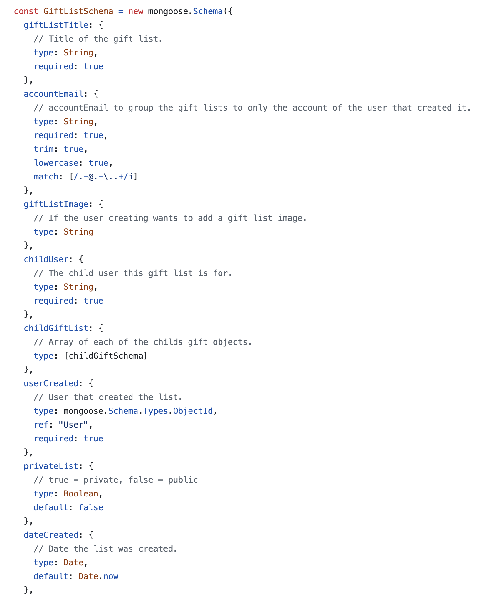
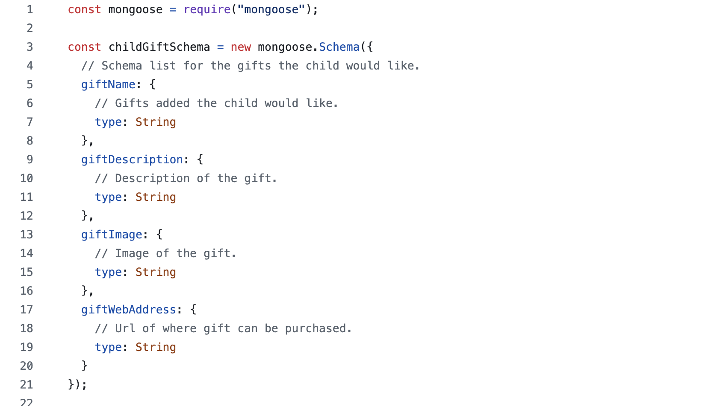

# T3A2 Part B Server

## Models:
Created the following JS files to the models folder:

## UserModel
The UserModel represents a data model for the user, and is typically used to define how the data about the users will be structured into a database. It could be part of a class or schema definition that interacts with a database like MongoDB, SQL or other equivalents. We are using a Mongoose framework (for MongoDB).

### UserSchema
Is the structure or definition of the user's data that will be stored in the database, it contains various fields that represent pieces of data for the user. The Schema helps enforce rules about how the data should be structured and what type of data should be stored in each field.

Some of the important fields to note are;

The accountEmail this is associated with the main account user. This field is used for login and/or communications.

Admin is a boolean indicating if the user has admin rights, it checks if they can perform administrative functions within the system.
The UserSchema code fields below defines the UserSchema within the UserModel, these fields describe various aspects of the users information such as personal details, contact information and roles like admin. This schema would be used to validate, store and retrieve the user data in a database.

    - UserSchema:

        Fields:
        - accountEmail
        - password
        - firstname
        - lastname
        - userEmail
        - phonenumber
        - admin
        - avatar
        - age

## GiftListModel
The GiftListModel is a structure which describes the layout of the GiftList model for a birthday registry. It defines two main components, the GiftListSchema and the childGiftSchema, which describes the structure of the giftlists and the structure of the desired gifts themselves. Below I have broken down further some of the key features.
The main model that will be used to define how the data is structured into the database for the giftlist application. It contains two schemas one for children childGiftSchema (for example, which will be a list to define gifts the child wants to receive for their birthday) and a GiftListSchema which will define the overall structure of the GiftList itself.

### childGiftSchema
The childGiftSchema describes the structure of each individual gift that could be part of the childs gift list. The fields under this schema represent individual gift attributes. 

The fields under the childGiftSchema are 
- <b>giftName</b> which is self explanatory. 
- <b>giftDescription</b> which helps provide  additional information about the specific gift, for example desirable product features, like specific colour, size, or quantity. 
- <b>giftImage</b> this could be a URL for the image which will help the family member to locate and purchase.
- <b>giftWebAddress</b> This is where you can add the link to a website to where the gift can be purchased from an e-commerce store.

#### childGiftSchema:
    
    - childGiftSchema

        Fields:
        - giftName
        - giftDescription
        - giftImage
        - giftWebAddress

### GiftListSchema
This defines the overall structure of the gift list. It represents a collection of gifts for a particular person, it can be used for a birthday, wedding, or baby shower. The fields in the GiftList Schema are 
- <b>giftListTitle</b> - this represents the title of the giftlist for example 'Darrens birthday' or 'Christmas' Gifts also with a countdown to the the special day.
- <b>accountEmail</b> - this is the account creating the gift list, and is associated with the user account.
- <b>giftListImage</b> - This is an image associated with the gift, for example a cover photo for the gift list similar to a profile image or photo.
- <b>childUser</b> - This is a user gift list and is created for a child or other user who wants to create a profile and gift list, this may be referenced by another user profile.
- <b>userCreated</b> This is used to create a profile.
- <b>privateList</b> This boolean field that indicates whether the created gift list is public or private. A private list would only be visible to the creator and selected people. whereas a public list could be shared with anyone.
- <b>dateCreated</b> The date the list was created, this could be useful for tracking and sorting gift lists by your creation time.
- <b>dateEvent</b> This enables you to put in the date of the birthday or event, to see a countdown until the special day. Helps to contextualise the gift list and can be used for event planning.

#### GiftListSchema:

    - GiftListSchema

        Fields:
        - giftListTitle
        - accountEmail
        - giftListImage
        - childUser
        - childGiftList
        - userCreated
        - privateList
        - dateCreated
        - dateEvent

## Relationship between the two Schemas
The GiftListSchema will use the childGiftSchema to reference the actual items/gifts in the created list. Each gift list is tied to an event or person (for example a childs birthday) and each gift within that list is described by it's own schema like name, image, description, web address. The childUser references the person for whom the gift list is made for while the childGiftList contains the list of desired gifts which gets structured by its relationship with childGiftSchema.

### Example in Code 

The childGiftSchema defines the structure of the individual gifts like name, image, description and URL.

The GiftListSchema defines the gift list which contains attributes such as the title of the actual gift list, the creators email address, the child user reference, the array of gifts desired, privacy settings and the final event date.

These schemas can be used together to create a system where the users can create a personalised gift list for future events such as birthdays, where each list may contain specific gifts with detailed information and purchase details and URL links.