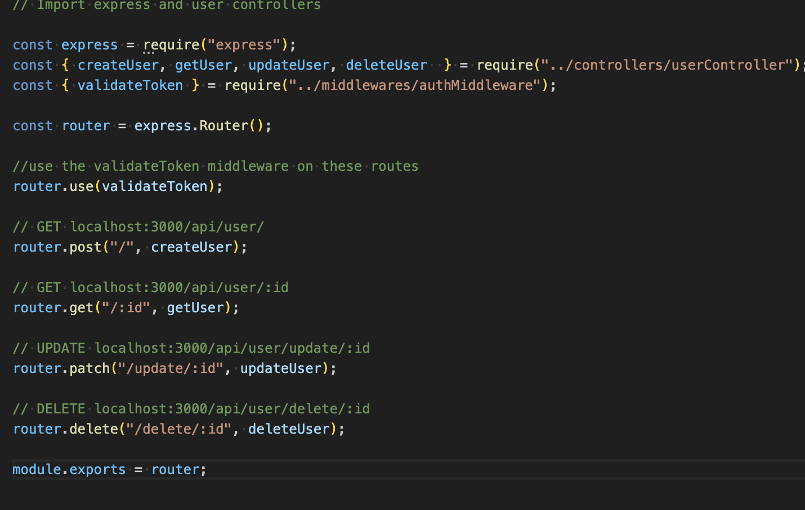

# T3A2 Part B Server

## Routes Importing

### authRoutes

This code snippet is importing <b>express, signupUser and loginUser </b> functions from the <b>authController</b> module.

    const express = require("express");
    const { signupUser, loginUser } = require("../controllers/authController");

    - express is a popular framwork for Node.js and it simplifies the process of handling the HTTP requests for routing, middleware and more. It is imported here to create an Express application to handle user requests like signing up and logging in.

    - when importing the two functions signupUser and loginUser from the authController module the functions are responsible for handling the sign up and login requests. The authController module contains the business logic related to authentication, signupUser handles the user registration while loginUser handles the verification to compare the password stores with the hashed stored password to confirm a match then return a JWT token to authenticate the user for future requests and access.

This code snippet is creating the Express Router instance for the express application, express.Router() is a feature that is provided by Express.js to modularise and organise the routes and define them for a specific set of URL's or paths.

    const router = express.Router();

The express.Routher() instance allows you to define the route handlers for HTTP methods like GET, POST, PUT, DELETE and associate them with their specifi URL patterns. Using a router helps keep your application modular by splitting the route logic into differenty modules and files, instead of one big file. You can use it to group related routes together or you can separate them within your application, keeping user-related routes in one file and authentication routes in another. 

This code snippet defines two POST routes for the user authentication, one is for the signup Route and one for the logi Route.

    // POST localhost:3000/api/auth/signup
    router.post("/signup", signupUser);

    // POST localhost:3000/api/auth/login
    router.post("/login", loginUser);

 
 When a POST request is made to the signupUser route the function is called. These functions take care of tasks like
    - validating data input
    - hashing the passwords for security
    - creating new users
    - respodning to client when new registration is successful

When a POST request is made to the loginUser route the function is called. These functions take care of the takes like
    - verifying the supplied login credentials ie username/email and password
    - compares the provided password with stored hashed password from the database
    - generates a JWT token if authentication is successful
    - returns a response back with the token (if correct) or an error message if invalid credentials are supplied.

This code snippet is the router object, which contains all the route definitions, it can be used in the main Express application and is mounted into the main app in app.js under a specified path like /api/auth.

    module.exports = router;

The <b>module.exports = router</b> is exported so it can be used by the main app. This structure keeps the authentication logic modular and allows for easy maintenance and scalability and maintains organisation.

## GiftList Routes

This code is setting up the routes in the express application to handle the Gift List related operations like CREATE, GET, UPDATE, and DELETE.

Firstly express is requred to create the express app and router.

    const express = require("express");
    const { createGiftList, getGiftList, updateGiftList, deleteGiftList  } = require("../controllers/giftListController");

Then the giftListController is where the logic for handling the gift lists is located. This file contains the actual implementation for creating, updating, fetching and deleting the gift lists.

    const { validateToken } = require("../middlewares/authMiddleware");

This validateToken middleware is used to check if the user is authenticated before being given access to any of the gift list routes.

    const router = express.Router();

This code creates the new router instance which will contain all the routes related to the Gift List. The validateToken middleware is applied toall routes in the router, this means for each request to any of these routes the miffleware will check if the user is authenticated and verify the JST token from the request headers. If the token is valid the request will continue, if the token is invalid or missing, it will return an error indicating authentiaction failure.

    // POST localhost:3000/api/giftlist/
    router.post("/", createGiftList)

This code defines the route when a POST request is sent to the giftlist and the createGiftList function is executed. It will validate the incoming data, create the new gift list in the database, then return a response to the client advising whether the gift list was successfully created of if there were any errors.

    // GET localhost:3000/api/giftlist/:id
    router.get("/giftlist/:id", getGiftList);

This code defines the route when a GET request for retrieving a gift list based on User ID. The route :ID in the URL is a route parameter, when a GET request is sent to the route it will retrieve the value of :id and use it to search the database for the corresponding gift list id. The getGiftList function will fetch the gift list from the database by the provided ID, then return the gift list data to the client. If gift list not found then it will return a 404 status error indicating that the list being search by id has not been found.

    // UPDATE localhost:3000/api/giftlist/update/:id
    router.patch("/giftlist/update/:id", updateGiftList);

This code defines a PATCH request route for updating an existing gift list based on its ID. The PATCH function will find the gift list by ID, then update the details with the supplied data in the request body, then return a respose to the client indicating whether the update was successful.

    / DELETE localhost:3000/api/giftlist/delete/:id
    router.delete("/giftlist/delete/:id", deleteGiftList);

This code defines a DELETE route to remove a gift list by its ID, the function will find and delte the fit list by provided ID, and return a response to the client to confirm the deletion. If not such gift list exists then it will return a 404 error Not Found.

    module.exports = router;

This code line exports the router instance so that it can be imported and used in the main app file or app.js

## User Routes

This code sets up the routes for handling the user related operations like CREATE, GET, PATCH, and DELETE a user, using Express.js

    const express = require("express");

This code imports the express module used to create the router and define the HTTP routes.

    const { createUser, getUser, updateUser, deleteUser  } = require("../controllers/userController");

This code snippet imports the controller functions for handling the user operations like create, get, update, and delete. 
    - The <b>createUser</b> function is used to create a new User.
    - The <b>getUser</b> function is used to retrieve a user's from the database based on a certain criteria
    - The <b>updateUser</b> function is used to update the users information.
    - The <b>deleteUser</b> function is used to delete a user.

    const { validateToken } = require("../middlewares/authMiddleware");

This code imports the validateToken middleware function which is designed to authenticate the user before allowing access to certain specified routes. The middleware checks the JWT token validity and ensures the user is authenticated before proceeding with the requested operation.

    const router = express.Router();

This code line creates a router instance and creates a new express router instance and the router will be used to define the routes for the user operations like create, get, update, and delete.

    //use the validateToken middleware on these routes
    router.use(validateToken);

This code is applying the validateToken middleware to all routes defined in the router. In Express.js the middleware functions are used to handle the request before it reaches the route handler, they are executed in the order they are defined. This function checks whether the user is authenticaated by verifying their JWT token. It will check the request headers, specifically the auth header for the valid token and either proceeds if the token is valid or sends a HTTP status error 401 Unauthorised message that the token is missing or invalid. By calling the <b>router.use(validateToken)</b> you automatically apply the validateToken middleware to all routes defined in the specific route instance. This means that for every request to the routes a validation function will run first.

    // POST localhost:3000/api/user/
    router.post("/", createUser);

This code is defining a POST route for creating a new user, the /path refers to the root path of this specific route module since its mounted on /api/user. The POST HTTP method is normally used for creating new resources on the server. 

The <b>createUser</b> function is the handler function that will execute wherever a POST request imade to the /api/user endpoint, this function should contain thelogic for processing the request to create the new user. With a REQUEST the client (like Postman) sents a POST to your local host with the user details in the request body like firstname, lastname, email, password etc, the createUser function will receive these details in the request and extract the necessare information from the request body. The sever then processes the data, validates it, hashes the password and saves it to the database.

The Respose after creating the User is when the server responds to the client with a success message with the users data, or an error message when an error occurs.

    / GET localhost:3000/api/user/:id
    router.get("/:id", getUser);

The above code line is defining a route to GET a route for retrieving a specific user's information based on their ID. the :id part of the URL is a route parameter that represents a dynamic value in this case the user's ID. When the GET request is made to the localhost the specific ID will be used to find the corresponding ID in the database

    // UPDATE localhost:3000/api/user/update/:id
    router.patch("/update/:id", updateUser);

This line of code is updating an existing users information. The :id specifies that the route is updating a specific user, the :id part of the route paramater will be updated with the actual user ID as part of the request. The PATCH method is typically used to update a resource and is used when only certain fields or attributes of the resource needs updating not a full replacement. It updates the details of the specific user by their specific user id.

The <b>updateUser</b> function is the handler that will be invoked when a PATCH request made. This function will contain all the logic to handle the update like validating the data, updating the data and returning the updated user data.  The REQUEST from the client like Postman sends a PATCH request to the localhost where the unit identifier of the user via their id, in the request body it will contain the fields that are being updated. The updateUser function will extract this information from the id from the URL parameter (req.params.id) and the new user data from the request body. The function then updates the users database. Once completed a RESPONSE will be returned with a success message and the updated user data, or if there is an error, it will be handled via either 404 Not Found or 500 Internal Server Error.

    // DELETE localhost:3000/api/user/delete/:id
    router.delete("/delete/:id", deleteUser);

This line of code is defining a DELETE route for a specific users information. The /delete/:id route will handle the deletion of a user with the :id as part of the route parameter which represents the users ID. The :id parameter can be accessed within the handler function using the <b>req.params.id.</b> The DELETE method is used to remove a rescouce from the server in this instance it is removing a user from the database based on their ID. Once the request is done, further deletions won't have any affect as the id has already been deleted.

The <b>deleteUser</b> function is the handler function that will execute a DELETE request when it is made on this route.

The REQUEST is handled from the client (Postman) in the frontend and will exectue a delete request when made on this route. This function will handle the logic of deleting the user from the database and responding appropriately with the status and a message. AFTER deleting the user the server will respond with a successful message or if the user does not exist or an error occurs the appropriate error message will be returned to the client of either 404 Not Found or 500 Internal Server Error.

If the user is found it calls the function <b>user.destroy()</b> which is a Sequelize method that deletes the record from the database.

    module.exports = router;

This line of code is used to export the router object which contains all the route handlers so that i can be used in other parts of the application.