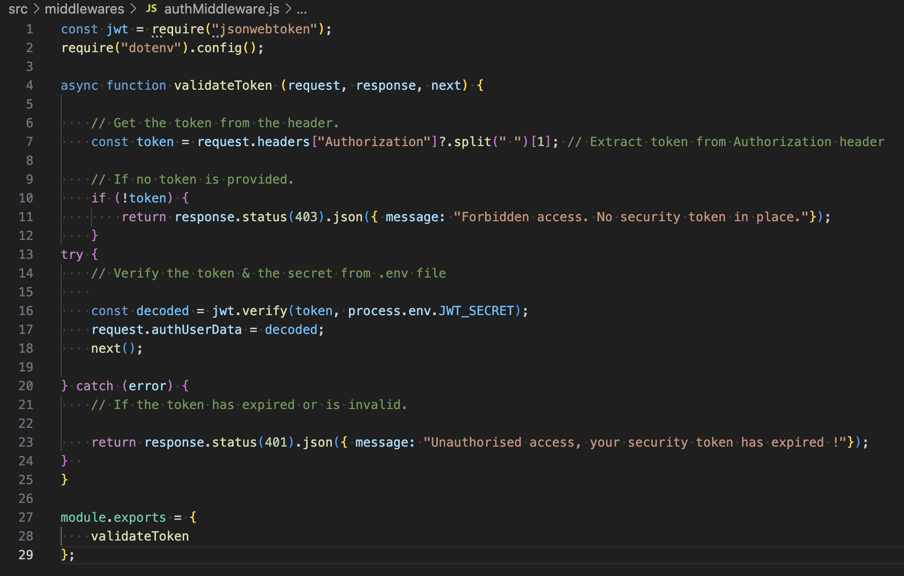

# T3A2 Part B Server

## Auth Middleware

This code defines a middleware function (validatteToken) for validating a JWT (JSON Web Token) authentication in Node.js application, it uses the jsonwebtoken library to verify tokens and check the user access to protected routes.

    const jwt = require("jsonwebtoken");

#### Importing Dependencies

This line of code imports the jsonwebtoken package which a library used to create, verify and decode JWT JSON Web Tokens. A JWT is a compact URL safe way of representing claims to be transferred between two parties, it is often used in authentication for web applications. When a user logs into the server it creates a JWT that contains the users identity or user ID it then reverts that back to the client. The client then includes a token in the head of future rquests to prove their identity.

    require("dotenv").config();

When you import the dotenv package it calls its config() function to load the environment variables from a .env file into process.env. These environment variables are typically used to store sensitive information like API keys, database credentials or secret keys outside of the codebase. You would usually store the secret key used for signing tokens inside the .env file. This way your sensitive information like JWT_SECRET is not hardcoded into your application which then improves your security.

#### Validate Token Middleware Function

    async function validateToken (request, response, next) 

This function is defining an Express middleware called validateToken. The Middleware functions are used in express to process requests before they reach the actual route handlers, this particular middleware is used to validate JWT tokens that are including in the requests to ensure the use is authenticated and authorised to access specific routes.

The <b>async</b> keyword is used to make the function asynchronous, meaning it can perform asynchronous operations like verifying a JWT using <b>await</b>. This allows it to perform tasks like reading from the database and/or verifying a token without blocking the main execution flow.

- <b>request</b> object contains the details of the HTTP request like headers, body, and query parameters.
- <b>response</b> object allows you to send responses back to the client.
- <b>next</b> callback function is used to pass control to the next middleware or route handler. If the token is valid.
- <b>next()</b> should be called to pass control to the next middleware or route handler, however if the token is invalid, an error response is sent and <b>next()</b> is not called.

#### Extracting the Token from the Header

    // Get the token from the header.
    const token = request.headers["Authorization"]?.split(" ")[1]; // Extract token from Authorization header

This function expects the token to be passed in the Authorisation heder of the HTTP request. It checks if the authorisation header contains a valid token, if it the Authorisation header exists, it splits the value a the space, and takes the second part(the token itself). If the token isn't provided it sends a HTTP status response 403 Forbidden status code and a message indicating "No security token in place" access has been denied because no token has been provided.

    // If no token is provided.
    if (!token) {
        return response.status(403).json({ message: "Forbidden access. No security token in place."});
    }

#### Verify Token

If a token is present, the middleware proceeds to verify the token using the <b>jwt.verify()</b> method from the JSONWebToken library. This method will then decode and validate the JWT against a secret key stored in the environment variable (request.authUserData) to ensure the token is legitimate and has not been tampered with.  If the token is expired or malformed, <b>jwt.verify()</b> will throw an error and the middleware will respod with a HTTP status code of 400 and a message indicating the token is invalid. If the token is valid then <b>jwt.verify()</b> will return the decoded payload of the user ID and other claims stored inside the token. This payload can be added to the request object so that  subsequent middleware and rout handlers can access it.

    try {
        // Verify the token & the secret from .env file
    
        const decoded = jwt.verify(token, process.env.JWT_SECRET);
        request.authUserData = decoded;
        next();

    } catch (error) {
        // If the token has expired or is invalid.

        return response.status(401).json({ message: "Unauthorised access, your security token has expired !"});
    }  

This is part of the JWT verification middleware which is designed to verify the authenticity of a JWT and attach the decoded tokens data to the request object. This allows the rest of the application to acess the user's data in subsequent middleware or route handlers. The

     <b>jwt.vertify(token,process.env.JWT_SECRET);</b>

is using the jsonwebtokens library to verify the JWT. The token is sent by the client (usually) in the authorisation header. The process.env.JWT_SECRET is the secret key that is used to sign the token, this secret key is stored in your .env file which ensures that it is kept safe and not hardcoded in your source code. If the token is valid and signed with the same secret key 
<b>jwt.verify()</b> will then decode the token and return the payload the user embedded in the token. If the token is invalid then it has either been tampered with, is expired or malformed and the verify() function will throw an error which gets caught in the catch block.

    <b>request.authUserData = decoded;</b> 
    next();

Is attached to the decoded user data, once the token is successfully verified, the decoded data is added to the request object. This makes the user data available to any subsequent route handlers or middleware.

<b>next()</b> function is called to pass the control to the next middleware or route handler in the request-response cycle. It is important to call next() after the verification process so that the request can continue to the next stage of handling.

<b>catch (error)</b> If an error is detected the <b>jwt.verify()</b> throws an error if the token is invalid or expired, the catch block will catch the error and return

    return response.status(401).json({ message: "Unauthorised access, your security token has expired !"});

If an error occurs the 400 status code is sent back to the client along with the message "Unauthorised access, security token has expired." This informs the client that they need to provide a valid token or reauthenticate if token has expired.

#### Exporting the Middleware
    
    module.exports = {
        validateToken
    };

This will export the validateToken function from the current file so that it can be imported and used in other parts of the application, such as routes or other middleware. This is essential for maintaining modular architecture in your Node.js application.  It is useful in protecting routes that require user authentication by ensuring that only valid tokens ca access them.
