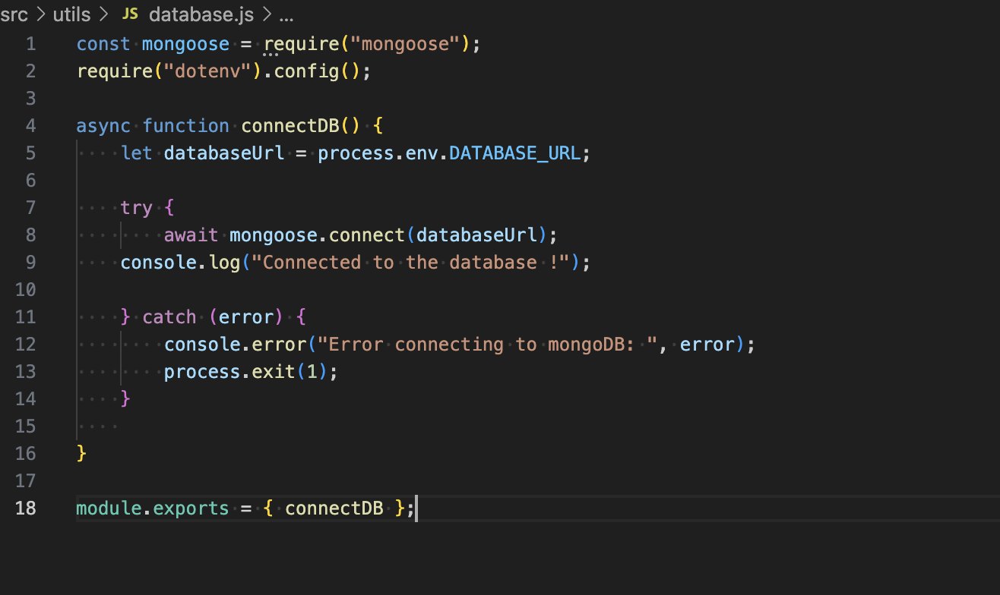

# T3A2 Part B Server

## Data Base - MongooseDB

This code is setting up the necessary imports and configurations for connecting to a MongoDB database using Mongoose in Node.js application.

    const mongoose = require("mongoose");

This line of code imports the Mongoose Library into your application. Mongoose is an ODM (Object Data Modeling) library for MongoDB and Node.js which provides a straightforward way to interact with MongoDB databases. With Mongoose you can define schemas and models for your MongoDB collections making it easier to validate, query and manipulate data.

    require("dotenv").config();

This line of code loads the environment variables from a .env file into process.env. The dotenv is a zero dependency module that loads environment variables from a .env file into process.env in your Node.js application. By using dotenv, you can store sensitieve data like API keys, database credentials and other configuration varibales inside the .env file. This helps keep your code base clean and secury by not hard coding sensite data directly inside your application.

    async function connectDB() {
    let databaseUrl = process.env.DATABASE_URL;

The connectDB function is defined to establish a connection to a database. It uses an environment variable <b>process.env.DATABASE_URL</b> to get the connection string for the database. Retrieving the database connection URL fron an environment variable called DATABASE_URL. This URL istypically stored in a .env file for security purposes to avoid hard coding sensitve credentials in the source code.

    
    try {
        await mongoose.connect(databaseUrl);
    console.log("Connected to the database !");

The logic for the connectDB function to connect to MongoDb using Mongoose. <b>mongoose.connect()</b> is the method that establishes the connection to the MongoDB database. If the connection is successful then the "successfully connected to the database!" message will be logged to the console. The async/await function ensures that the application waits for the connection to the database before proceeding. This prevents any attempts to start the server without an active connection.

     } catch (error) {
        console.error("Error connecting to mongoDB: ", error);
        process.exit(1);
    }

If the connection fails the error is caught in the catch (error) block. <b>console.error("Error connecting to mongoDB: ") message logs the error message to the console making it easier to understand the cause of the issue. Using try/catch blocks ensures that if the connection to the database fails, you log the error and prevent the server from starting by using process.exit(1).

<b>process.exit(1)</b> This line of code exits the application with a non-zero status code, indicating failure. This is important because it prevents yor app from running if it can't connect to the database.

    module.exports = { connectDB };

This line of code allows other parts of your application to import and use the connect DB function to establish a database connection.

### How to Use the connectDb Function

You will call <b>connectDb</b> when starting your application to ensure that the connection to the database is made before running the rest of your app.

The connectDB function connects the MongoDB database using Mongoose and ensures that the connecte is successful before proceeding, it handles errors by logging them and exiting the process with a failture status if the connect fails. This function is essential for ensuring that the database is properly connected before your application starts its operations.